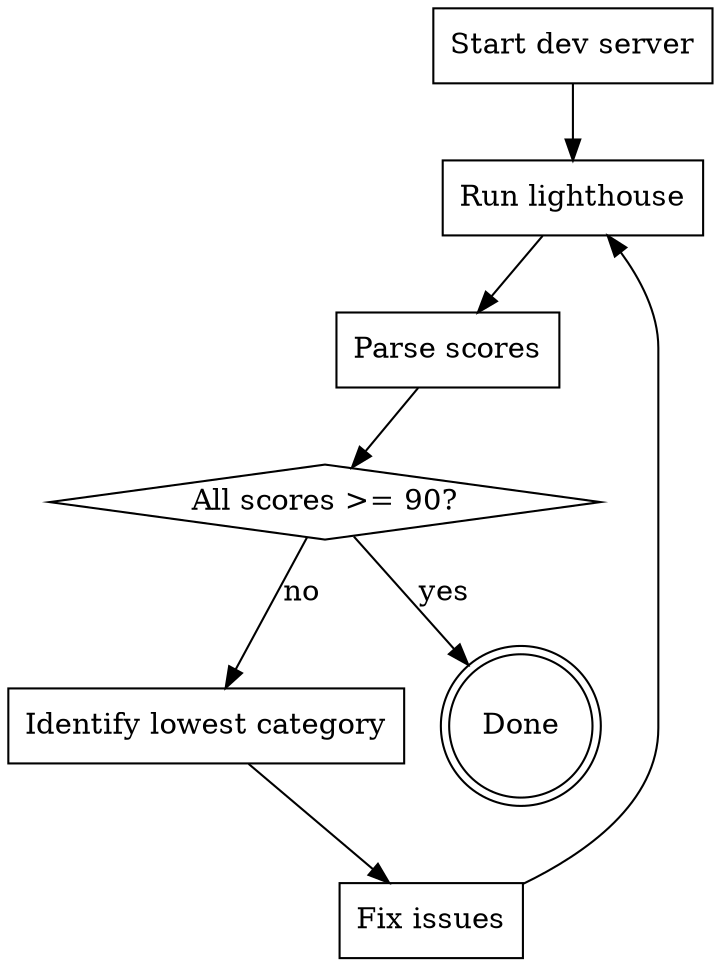

# Lighthouse Optimization

Iteratively improve Lighthouse scores until all categories reach 90+.

## Overview

Run Lighthouse against a running dev server, parse the report, identify issues, fix them, and repeat. The goal is 90+ across: Performance, Accessibility, Best Practices, and SEO.

## Prerequisites

- `jq` JSON CLI
- Lighthouse CLI installed: `npm install -g lighthouse` or `bun install -g lighthouse`
- Dev server running or ability to start it

## Workflow



## Running Lighthouse

```bash
# Start dev server first (in background)
bun run dev &

# Wait for server ready, then run lighthouse
lighthouse http://localhost:3000 --output=json --output-path=./lighthouse-report.json --chrome-flags="--headless"

# View scores summary
cat lighthouse-report.json | jq '.categories | to_entries[] | {name: .key, score: .value.score}'
```

For CI or faster runs:
```bash
lighthouse http://localhost:3000 --output=json --only-categories=performance,accessibility,best-practices,seo --chrome-flags="--headless --no-sandbox"
```

## Parsing the Report

Extract scores and issues:

```bash
# Get all category scores (0-1 scale, multiply by 100)
jq '.categories | to_entries[] | "\(.key): \(.value.score * 100 | floor)"' lighthouse-report.json

# Get failed audits (score < 1)
jq '.categories | to_entries[] | .value.auditRefs[] | select(.result.score != null and .result.score < 1) | .result' lighthouse-report.json
```

## Category Fixes

### Performance (< 90)

**Common issues:**
- **Large bundle size**: Code-split with dynamic imports, lazy load components
- **Unoptimized images**: Use `next/image` with proper sizing
- **Render-blocking resources**: Move scripts to end of body, use `async`/`defer`
- **Excessive DOM size**: Reduce element count, virtualize long lists
- **Unused CSS/JS**: Tree-shake, remove dead code

**Quick wins:**
```tsx
// Lazy load heavy components
const HeavyComponent = dynamic(() => import('./HeavyComponent'), { loading: () => <Skeleton /> })

// Optimize images
<Image src="/hero.jpg" width={1200} height={630} alt="Hero" priority />

// Font optimization (in layout.tsx)
import { Inter } from 'next/font/google'
const inter = Inter({ subsets: ['latin'], display: 'swap' })
```

### Accessibility (< 90)

**Common issues:**
- **Missing alt text**: Add descriptive alt to all images
- **Low contrast**: Ensure text contrast ratio >= 4.5:1
- **Missing form labels**: Associate labels with inputs
- **Missing lang attribute**: Ensure `<html lang="en">`
- **No skip link**: Add skip-to-content link for keyboard users

**Quick wins:**
```tsx
// Skip link for accessibility
<a href="#content" className="sr-only focus:not-sr-only">Skip to content</a>

// Proper form labeling
<Label htmlFor="email">Email</Label>
<Input id="email" type="email" />
```

### Best Practices (< 90)

**Common issues:**
- **Console errors**: Remove console.log in production
- **Deprecated APIs**: Update to modern equivalents
- **Missing doctype**: Ensure `<!DOCTYPE html>`
- **HTTPS**: Use HTTPS in production
- **CSP headers**: Add Content Security Policy

**Quick wins:**
```tsx
// Remove console in production
if (process.env.NODE_ENV !== 'production') {
  console.log('debug info')
}
```

### SEO (< 90)

**Common issues:**
- **Missing meta description**: Add to layout/page metadata
- **Missing viewport**: Ensure viewport meta tag
- **No h1**: Ensure exactly one h1 per page
- **Low text contrast**: Same as accessibility
- **Missing structured data**: Add JSON-LD

**Quick wins:**
```tsx
// In layout.tsx or page.tsx
export const metadata: Metadata = {
  title: 'Page Title',
  description: 'Page description for search engines',
}
```

## Iteration Process

1. **Run lighthouse** and capture scores
2. **Identify lowest category** - focus there first
3. **Read failed audits** from the JSON report
4. **Apply targeted fixes** for top 2-3 issues
5. **Re-run lighthouse** to verify improvement
6. **Repeat** until all categories >= 90

## Score Thresholds

| Score | Status |
|-------|--------|
| 90-100 | Pass (green) |
| 50-89 | Needs improvement (orange) |
| 0-49 | Failing (red) |

## Common Patterns

### Next.js Performance Optimization

```tsx
// next.config.ts
export default {
  images: { formats: ['image/avif', 'image/webp'] },
  compiler: { removeConsole: process.env.NODE_ENV === 'production' },
}
```

### Font Optimization

```tsx
// Use next/font for automatic optimization
import { Montserrat } from 'next/font/google'
const font = Montserrat({ 
  subsets: ['latin'],
  display: 'swap',
  variable: '--font-montserrat'
})
```

## Red Flags

- Making changes without re-running lighthouse
- Optimizing categories that are already 90+
- Ignoring mobile performance scores
- Skipping accessibility issues as "minor"
